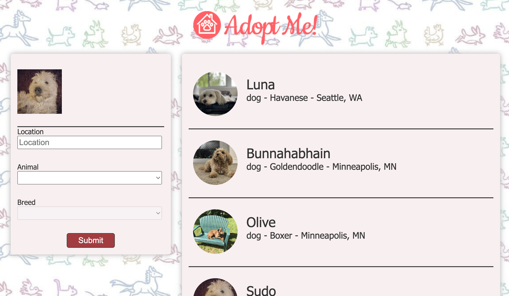

# Intro to React v 18.0

- [Instructions](https://react-v8.holt.courses/)
- [Code](https://github.com/btholt/citr-v8-project)

  application to browse adoptable pets
  

## Features

- ESLint and Prettier
- Vite -> building tool
- function components
- class components
- uncontrolled form
- hooks (useState, useEffect)
- react query instead of effects
- react router for client side routing
- custom hooks
- error boundaries
- modals with portals
- context
